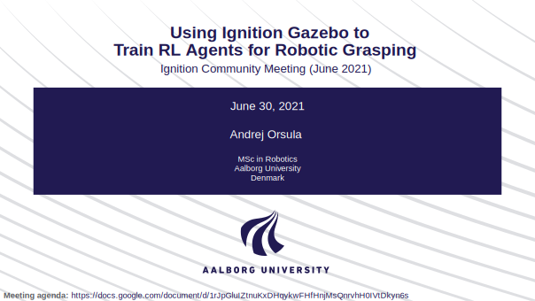

# Presentation for Master's Thesis - Deep Reinforcement Learning for Robotic Grasping from Octrees

This repository contains LaTeX (Beamer) setup for the presentation of my Master's Thesis conducted at Aalborg University, Denmark. Master's Thesis can be found under [AndrejOrsula/master_thesis](https://github.com/AndrejOrsula/master_thesis). If you are interested in the source code, please see [AndrejOrsula/drl_grasping](https://github.com/AndrejOrsula/drl_grasping).

Compiled PDF: [**presentation.pdf**](./presentation.pdf)

> The PDF contains embedded videos that might not be supported on your browser's default viewer. If that is the case, please try a different viewer. Alternatively, some of the recordings can also be viewed under [YouTube playlist](https://youtube.com/playlist?list=PLzcIGFRbGF3Qr4XSzAjNwOMPaeDn5J6i1).

> Please see [presentation_without_embedded_videos.pdf](./presentation_drl_grasping_ign_jun_2021_without_embedded_videos.pdf) for a PDF with much smaller size (without embedded videos and compressed).

## Disclaimer (LaTeX Template)

Latex template is adapted from [jkjaer/aauLatexTemplates](https://github.com/jkjaer/aauLatexTemplates) and modified to my preferences.
